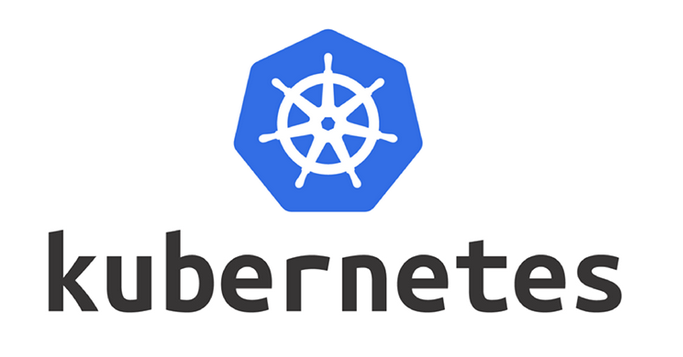

# テラバイト時代の基盤を創る、DXを革新するプラットフォームエンジニア
<!-- background image 

-->
<!-- background color -->

DXプラットフォームエンジニアとして、大規模データ基盤やエンジニア育成を行っており、
Kubernetes、Docker、OSS活用を通じて、企業のデジタルトランスフォーメーションを支援します。

# ミッション
## 1から実装できるエンジニア教育

実装力はすべての基本です。多くの企業での企画が成功するかどうかは、アイデアを迅速に形にし、検証する能力にかかっています。特に、実際に動作する環境を素早く構築できるスキルは、プロジェクトのスピードや柔軟性を大きく向上させます。

私は、ハードウェアが与えられた状態からスタートし、1日で以下のような一連の作業を完了できるエンジニアを育てます：

・OSのインストール：適切な環境設定や必要なドライバの導入を含む。
・基盤ソフトウェアの設定：DockerやKubernetesなどの仮想化環境や、必要なミドルウェアのセットアップ。
・サービスの構築：具体的なアプリケーションやOSS（例えば、Webサーバ、データベースなど）を展開し、動作確認を行う。
・ラブルシューティング：問題が発生した場合の原因追及と解決策の実施。

これにより、検証用プロトタイプを迅速に構築し、実際のビジネス要件に基づいた改善を繰り返す能力を養います。このスキルは、開発プロセス全体を加速させ、企画の実現可能性を高める重要な要素です。

## 企業のDXを確実に実現するコンサルティング

現在、厚生労働省のデータによると、約80%の企業ではDXを実現できていないという現実があります。

しかし、これは決して嘆くべき結果ではありません。DXは単なる技術導入だけでなく、業務の根本的な変革を伴うものであり、その実現には時間と努力が必要です。

実際のコンサルティングにおいては、まずDXを正しく定義します。DXとは、テクノロジーを先に導入し、それに合わせて業務プロセスや仕組みを変革していくという、従来のシステム構築フローの逆転にあります。この逆転が業務の効率化や柔軟性をもたらします。

その上で、DXに見合った業務変革の箇所を洗い出し、それらが実現可能かどうかを実現性の検証を行います。必要な技術やシステムがどれだけ現状の業務に適合するか、またその導入に対する組織の準備が整っているかを確認します。

さらに、DXの実現にはそれを支えるエンジニアの力と、部署間の連携、そして強力なコミュニケーションが欠かせません。システムサイドだけを担当するベンダーに依存するのではなく、全社的な変革を進めるためには、エンジニアと業務部門が連携し、協力することが不可欠です。

そのため、実現したい目標に対して、適切なエンジニア力や部署間の連携が十分にできているかを確認し、問題があればその解決策についてもアドバイスを行います。企業全体での変革を成功に導くための支援を行っています。

# 実績

Hadoopを使ったペタバイト単位のデータプラットフォーム構築

test

test2
https://speakerdeck.com/halchil/monitoring-part2

test iframe
<iframe class="speakerdeck-iframe" style="border: 0px; background: rgba(0, 0, 0, 0.1) padding-box; margin: 0px; padding: 0px; border-radius: 6px; box-shadow: rgba(0, 0, 0, 0.2) 0px 5px 40px; width: 100%; height: auto; aspect-ratio: 560 / 315;" frameborder="0" src="https://speakerdeck.com/player/645a33c608164c64bdd3590e0b56274c" title="Monitoring part2" allowfullscreen="true" data-ratio="1.7777777777777777"></iframe>

test4 

[Speaker Deck: Monitoring part2](https://speakerdeck.com/halchil/monitoring-part2)

AWSを使ったBIツールの導入

Azure基盤上に生成AIを持ちいたRAG環境の構築

OSSを活用したDevOps、監視、バッチ環境の構築

エンジニア育成でプロジェクト成功率アップ

画像

<!-- 幅と高さを指定
# 

次

私は春山です。

エンジニアです。

# SNSリンクと連絡先

- 
- 

# 経歴

2020年 株式会社インテック入社
-->